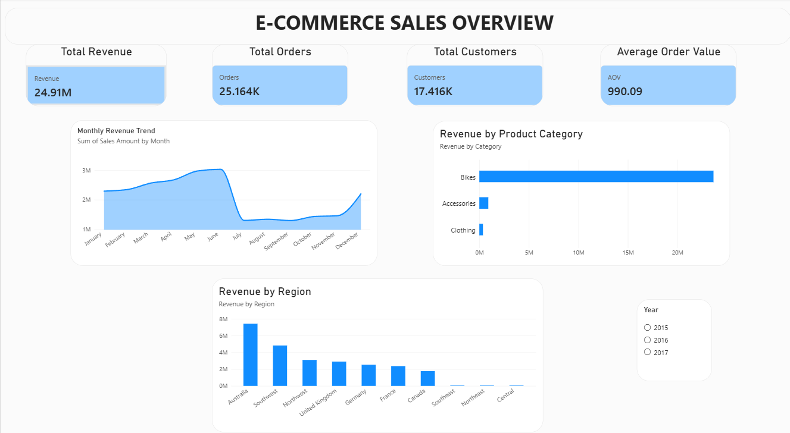
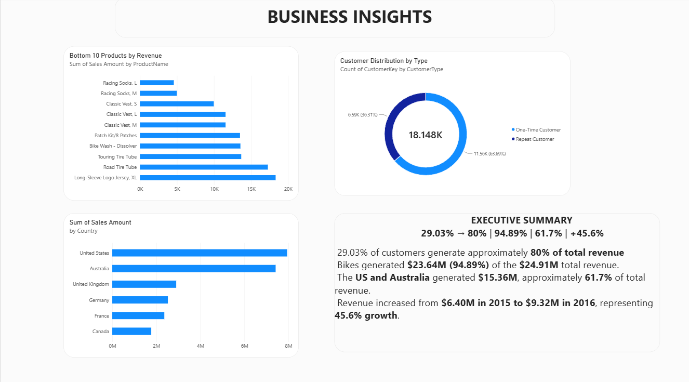
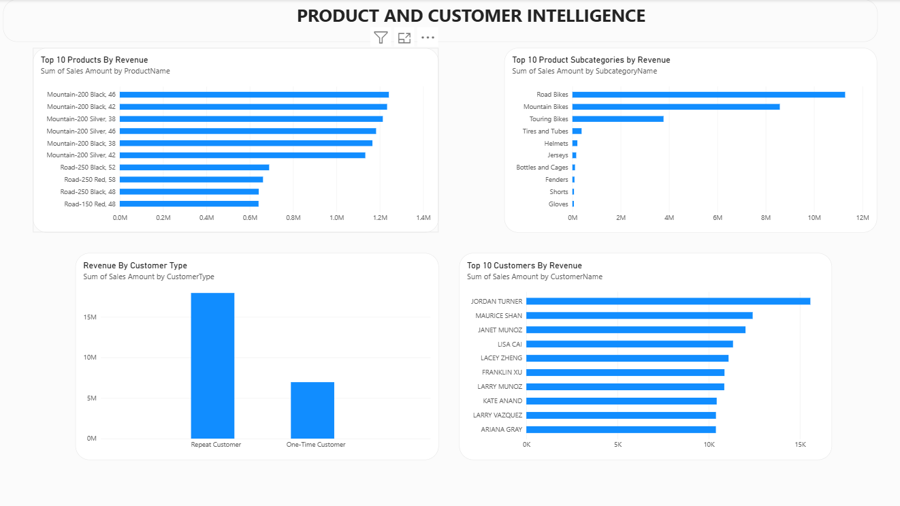
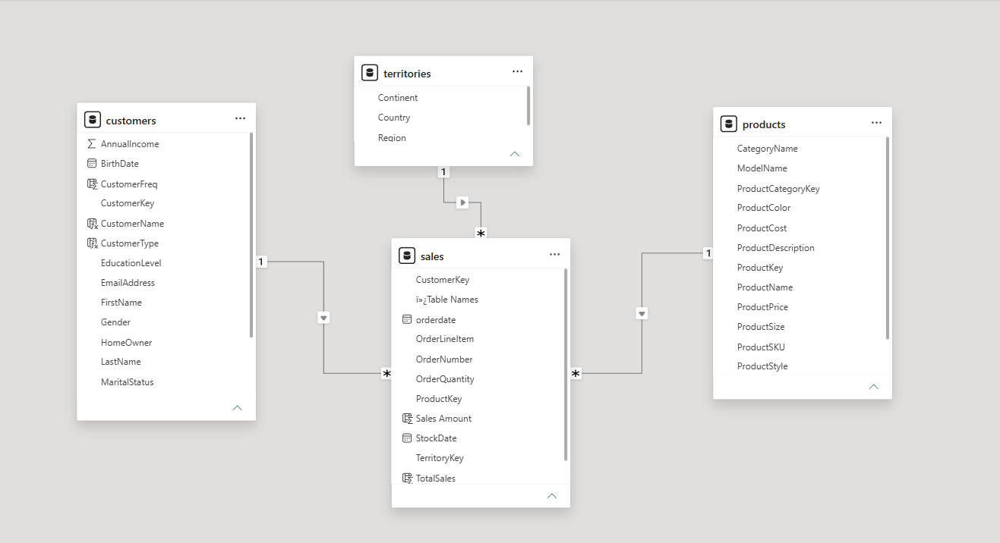

<div align="center">

# 🚀 AdventureWorks Business Intelligence Case Study

### End-to-End SQL & Power BI Analytics Project


---

### 📊 Transforming Retail Data into Actionable Business Insights

*An end-to-end Business Intelligence project demonstrating database understanding, advanced SQL analytics, data modeling, KPI development, and interactive Power BI dashboard development using the AdventureWorks dataset.*

</div>

---

# 📖 Project Overview

This repository presents an end-to-end **Business Intelligence case study** built using the **AdventureWorks retail database**.

The project simulates the workflow of a Business Intelligence / Data Analyst by transforming raw relational data into business-ready insights.

The analysis covers:

* Sales performance
* Customer purchasing behavior
* Product and category performance
* Geographic performance
* Revenue trends
* Customer contribution and segmentation
* Key business KPIs

The project combines **MySQL for data exploration and analytical querying** with **Power BI for data modeling, visualization, and business reporting**.

---

# 🎯 Business Objectives

The primary objectives of this project are to:

* 📊 Analyze overall sales and revenue performance
* 📈 Identify sales growth trends over time
* 👥 Understand customer purchasing behavior
* 💰 Identify high-value customers
* 🛍️ Evaluate product and category contribution
* 🌍 Compare performance across territories
* 🔎 Identify important business patterns using advanced SQL
* 📊 Build an interactive Power BI dashboard for decision-making
* 💡 Translate analytical findings into actionable business insights

---

# 🛠️ Tech Stack

| Technology          | Purpose                                                          |
| ------------------- | ---------------------------------------------------------------- |
| 🐬 **MySQL 8.0**    | Data exploration, transformation, and SQL analytics              |
| 📊 **Power BI**     | Data modeling, DAX, KPI development, and dashboard visualization |
| 📝 **Git & GitHub** | Version control and project documentation                        |
| 📄 **Markdown**     | Technical documentation                                          |

---

# 📂 Project Structure

```text
AdventureWorks-Business-Analytics
│
├── 📂 Documentation
│   ├── Data Dictionary.md
│   ├── Business Usage.md
│   ├── Data Profiling.md
│   └── ER Diagram.png
│
├── 📂 SQL
│   ├── Data Exploration.sql
│   ├── Sales Analysis.sql
│   ├── Customer Analysis.sql
│   ├── Product Analysis.sql
│   ├── Territory Analysis.sql
│   └── Advanced SQL.sql
│
├── 📂 Dashboard
│   ├── AdventureWorks Dashboard.pbix
│   ├── Sales-Overview.png
│   ├── Business-Insights.png
│   └── Product-Customer-Intelligence.png
│
├── 📂 Dataset
│
└── README.md
```

---

# 📚 Skills Demonstrated

## 🐬 SQL & Data Analysis

* Joins
* Aggregate Functions
* Subqueries
* CASE expressions
* Common Table Expressions (CTEs)
* Window Functions
* Ranking
* Running totals
* Customer-level analysis
* Revenue analysis
* Year-over-Year analysis
* RFM-style customer analysis
* Pareto analysis
* Data transformation
* Views

## 📊 Business Intelligence

* KPI development
* Sales performance analysis
* Customer analytics
* Product analytics
* Territory analysis
* Revenue analysis
* Time-series analysis
* Business question formulation
* Insight generation

## 🧩 Data Modeling

* Relational database concepts
* Primary and foreign keys
* Fact & dimension relationships
* Power BI semantic modeling
* Many-to-one relationships
* Data model validation

## 📈 Power BI

* Interactive dashboards
* DAX measures
* KPI cards
* Slicers
* Bar and column charts
* Trend analysis
* Customer segmentation visuals
* Geographic analysis
* Business-focused dashboard design

---

# 🗄️ Dataset

The project uses the **AdventureWorks retail dataset**, containing information related to:

* Customers
* Products
* Product Categories
* Product Subcategories
* Sales Transactions
* Territories

The sales data contains **60K+ sales transactions** used for the analysis.

---

# 🔍 Data Preparation

Before performing the analysis, the dataset was examined and prepared for analytical use.

Key preparation steps included:

* Understanding table structures and relationships
* Reviewing primary and foreign key relationships
* Profiling important columns
* Standardizing date information
* Converting sales dates into appropriate date formats
* Validating relationships between sales, products, customers, and territories
* Creating analytical views where required

This ensured that the SQL analysis and Power BI model were based on consistent and usable data.

---

# 🐬 SQL Analysis

SQL was used as the primary analytical layer for answering business questions and deriving measurable insights.

The analysis used:

* Multiple table joins
* Aggregations
* CTEs
* Window functions
* Ranking functions
* CASE expressions
* Subqueries
* Views
* Date-based analysis

### Examples of Analytical Techniques

#### 📈 Year-over-Year Analysis

Revenue was analyzed across different years to understand business growth.

#### 👥 Customer Contribution Analysis

Customers were ranked based on their revenue contribution to identify high-value customer segments.

#### 🎯 Pareto Analysis

A cumulative revenue analysis was used to determine how many customers were responsible for approximately 80% of total revenue.

#### 🛍️ Product & Category Analysis

Revenue was analyzed across product categories and subcategories to identify major revenue drivers.

#### 🌍 Territory Analysis

Sales performance was compared across different countries and territories.

---

# 📊 Key Business Findings

The SQL analysis produced several significant findings.

## 💰 Overall Revenue

The analyzed sales data generated approximately:

### **$24.91M Total Revenue**

from more than:

### **60K+ Sales Transactions**

---

## 📈 Revenue by Year

| Year  | Revenue |
| ----- | ------: |
| 2015  |  $6.40M |
| 2016  |  $9.32M |
| 2017* |  $9.19M |

*2017 represents the available period in the dataset.

Revenue increased substantially from 2015 to 2016, representing approximately **45.6% year-over-year growth**.

---

## 🛍️ Category Performance

| Category    | Revenue | Contribution |
| ----------- | ------: | -----------: |
| Bikes       | $23.64M |       94.89% |
| Accessories |  $0.91M |        3.64% |
| Clothing    |  $0.37M |        1.47% |

The analysis shows that **Bikes are the dominant revenue contributor**, accounting for approximately 95% of total revenue.

---

## 👥 Customer Revenue Concentration

Pareto analysis showed that approximately:

### **29.03% of customers generated 80% of total revenue.**

The top 10% of customers contributed approximately:

### **40.36% of total revenue.**

This highlights a strong concentration of revenue among a relatively smaller group of customers.

---

## 🌍 Revenue by Country

| Country        | Revenue |
| -------------- | ------: |
| United States  |  $7.94M |
| Australia      |  $7.42M |
| United Kingdom |  $2.90M |
| Germany        |  $2.52M |
| France         |  $2.36M |
| Canada         |  $1.77M |

The United States and Australia represented the largest revenue contributions among the analyzed countries.

---

## 👤 Revenue by Gender

| Gender        | Revenue |
| ------------- | ------: |
| Female        | $12.52M |
| Male          | $12.24M |
| Not Available |  $0.16M |

Revenue was relatively balanced between male and female customers in the analyzed dataset.

---

# 🧩 Power BI Data Model

The cleaned analytical data was imported into Power BI and organized into a relational semantic model.

The model connects sales data with relevant dimensions including:

```text
                 ┌───────────────┐
                 │   Customers   │
                 └───────┬───────┘
                         │
                         │
┌──────────────┐   ┌─────▼──────┐   ┌──────────────┐
│   Products   │───│    Sales   │───│  Territories │
└──────────────┘   └────────────┘   └──────────────┘
       │
       │
┌──────▼─────────────┐
│ Product Categories │
└────────────────────┘
```

The model was designed to support:

* Revenue analysis
* Customer analysis
* Product analysis
* Territory analysis
* Time-based analysis
* Interactive filtering

---

# 📊 Power BI Dashboard

The Power BI dashboard converts the analytical results into an interactive reporting layer.

### Key KPIs

The dashboard includes metrics such as:

* Total Revenue
* Average Order Value
* Number of Orders
* Number of Customers
* Customer Type
* Revenue by Category
* Revenue by Country
* Revenue Trends
* Customer Contribution

### Dashboard Features

* Interactive slicers
* KPI cards
* Revenue trend analysis
* Category performance
* Geographic performance
* Customer analysis
* Dynamic filtering
* Business-focused visualizations

---

# 🖼️ Dashboard Preview

## 📈 Sales Overview



---

## 💡 Business Insights



---

## 📊 Product & Customer Intelligence



---
## 🔗 Power BI Data Model

The Power BI semantic model connects the sales fact table with customer, product, and territory dimensions to support consistent analysis across the dashboard.



# 💡 Business Insights

The analysis provides several business-oriented observations:

### 1. Revenue is highly concentrated in the Bikes category

Bikes contribute approximately 95% of total revenue, making this category the primary revenue driver in the analyzed dataset.

### 2. Revenue is concentrated among a smaller customer segment

Approximately 29% of customers account for 80% of revenue, indicating that customer contribution is highly uneven.

### 3. Revenue increased significantly between 2015 and 2016

The analysis identified approximately 45.6% year-over-year revenue growth from 2015 to 2016.

### 4. The United States and Australia are major markets

These two countries generated the highest revenue among the analyzed territories.

### 5. Customer revenue is relatively balanced by gender

The analyzed revenue distribution between male and female customers is relatively similar.

---

# 🎯 Business Recommendations

Based on the analytical findings, potential business actions include:

* Focus retention strategies on high-value customers.
* Monitor the performance and availability of the Bikes category because of its dominant revenue contribution.
* Investigate the drivers behind the strong revenue growth observed between 2015 and 2016.
* Analyze customer purchasing behavior across major geographic markets.
* Explore opportunities to increase Accessories and Clothing revenue.
* Use customer segmentation to support targeted marketing and retention strategies.

---

# 🔄 Project Workflow

```text
Raw AdventureWorks Dataset
          ↓
Database & Schema Understanding
          ↓
Data Profiling & Documentation
          ↓
Data Preparation
          ↓
MySQL Analytical Queries
          ↓
Business KPI & Insight Generation
          ↓
Power BI Data Modeling
          ↓
DAX Measures & Calculations
          ↓
Interactive Dashboard
          ↓
Business Insights & Recommendations
```

---

# 📌 Key Project Metrics

| Metric                                |      Result |
| ------------------------------------- | ----------: |
| Total Revenue                         | **$24.91M** |
| Sales Transactions                    |    **60K+** |
| Bikes Revenue Contribution            |  **94.89%** |
| Customers generating 80% revenue      |  **29.03%** |
| Top 10% Customer Revenue Contribution |  **40.36%** |
| 2016 YoY Revenue Growth               |   **45.6%** |

---

# 🚧 Project Status

| Phase                     | Status      |
| ------------------------- | ----------- |
| 📖 Database Understanding | ✅ Completed |
| 📝 Data Documentation     | ✅ Completed |
| 🔍 Data Profiling         | ✅ Completed |
| 🐬 SQL Analytics          | ✅ Completed |
| 🧩 Data Modeling          | ✅ Completed |
| 📊 Power BI Dashboard     | ✅ Completed |
| 💡 Business Insights      | ✅ Completed |
| 📄 GitHub Documentation   | ✅ Completed |

---

# 🌟 Project Highlights

* End-to-end Business Intelligence workflow
* 60K+ sales transactions analyzed
* $24.91M revenue analyzed
* Advanced SQL analytical techniques
* CTEs and window functions
* Customer contribution and Pareto analysis
* Power BI semantic data modeling
* Interactive KPI dashboard
* Business-focused insights and recommendations
* Professional project documentation

---

# 📁 Repository Contents

The repository contains:

* 📄 Data documentation
* 🗂️ ER diagram
* 🔍 Data profiling documentation
* 🐬 SQL analytical queries
* 📊 Power BI dashboard
* 📸 Dashboard screenshots
* 📚 Business analysis documentation

---

# 🚀 How to Explore the Project

### 1. Explore the Documentation

Start with the files inside the `Documentation` folder to understand the dataset and business context.

### 2. Review the SQL Analysis

Open the SQL scripts to understand how the business questions were translated into analytical queries.

### 3. Open the Power BI Dashboard

Open the `.pbix` file using Power BI Desktop to explore the interactive dashboard and underlying data model.

### 4. Review the Findings

Use the documented KPIs and insights to understand the business conclusions derived from the analysis.

---

# 🔮 Future Improvements

Potential extensions to the project include:

* Customer lifetime value analysis
* Customer retention analysis
* Demand forecasting
* More detailed product-level profitability analysis
* Automated data refresh
* Additional executive-level dashboard pages

---

<div align="center">

### ⭐ AdventureWorks Business Intelligence Case Study

**Built using MySQL, Power BI, SQL Analytics & Business Intelligence Concepts**

</div>
